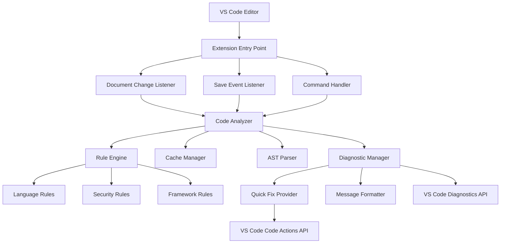
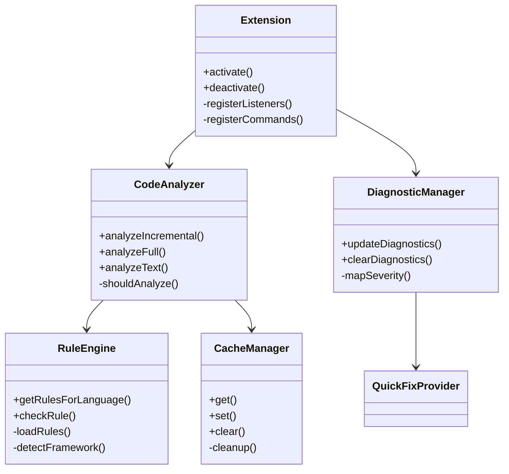
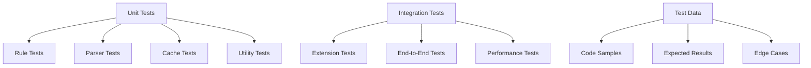

# Design Document

## Overview

VibeGuard 是一个 VS Code 扩展插件，采用模块化架构设计，实现实时代码安全分析。系统核心包括代码分析引擎、规则引擎、诊断管理器和缓存系统，支持多种编程语言的安全风险检测。

设计目标：
- 实时性：在用户编辑代码时提供即时反馈
- 准确性：通过 AST 分析和上下文感知减少误报
- 性能：增量分析和智能缓存确保流畅体验
- 扩展性：模块化设计支持新语言和规则的轻松添加

## Architecture

### 系统架构图



### 核心模块关系



## Components and Interfaces

### 1. Extension Entry Point (extension.ts)

**职责**：插件生命周期管理、事件监听注册、组件初始化

```typescript
interface ExtensionContext {
    subscriptions: vscode.Disposable[];
    workspaceState: vscode.Memento;
    globalState: vscode.Memento;
}

interface ExtensionAPI {
    activate(context: ExtensionContext): void;
    deactivate(): void;
}
```

**核心功能**：
- 注册文档变更监听器（防抖 500ms）
- 注册文件保存监听器
- 注册快速修复提供者
- 注册命令处理器
- 初始化核心组件

### 2. Code Analyzer (CodeAnalyzer.ts)

**职责**：代码分析的核心引擎，协调各个组件完成分析任务

```typescript
interface CodeAnalyzer {
    analyzeIncremental(event: TextDocumentChangeEvent): Promise<Issue[]>;
    analyzeFull(document: TextDocument): Promise<Issue[]>;
    analyzeText(text: string, languageId: string, lineOffset: number): Promise<Issue[]>;
}

interface Issue {
    line: number;
    column: number;
    severity: 'error' | 'warning' | 'info';
    message: string;
    code: string;
    quickFix?: QuickFix;
    category: 'security' | 'performance' | 'quality';
}
```

**分析策略**：
- 增量分析：只分析变更的代码行
- 全量分析：文件保存时进行完整检查
- 智能缓存：缓存 AST 和分析结果

### 3. Rule Engine (RuleEngine.ts)

**职责**：规则管理和匹配，支持多种匹配策略

```typescript
interface RuleEngine {
    getRulesForLanguage(languageId: string): Rule[];
    checkRule(rule: Rule, text: string, ast?: AST): Promise<RuleMatch[]>;
    loadCustomRules(configPath: string): void;
}

interface Rule {
    code: string;
    severity: 'error' | 'warning' | 'info';
    message: string;
    languages: string[];
    frameworks?: string[];
    pattern?: RegExp;
    astPattern?: ASTPattern;
    quickFix?: QuickFixTemplate;
    metadata: {
        category: string;
        tags: string[];
        docs: string;
        cwe?: string; // Common Weakness Enumeration
    };
}

interface ASTPattern {
    nodeType: string;
    conditions: ASTCondition[];
    context?: ContextRequirement[];
}
```

**规则分类**：
- SQL 安全规则：无条件 DELETE/UPDATE、DROP 操作、注入风险
- JavaScript 安全规则：eval、innerHTML、命令注入
- 框架特定规则：React hooks、Vue 指令、Node.js API
- 配置安全规则：密钥泄露、生产环境配置

### 4. AST Parser (parsers/)

**职责**：将代码解析为抽象语法树，支持精确的语法分析

```typescript
interface ASTParser {
    parse(code: string, languageId: string): Promise<AST>;
    isSupported(languageId: string): boolean;
}

interface AST {
    type: string;
    body: ASTNode[];
    sourceType: 'script' | 'module';
    comments?: Comment[];
}

interface ASTNode {
    type: string;
    start: number;
    end: number;
    loc: SourceLocation;
    [key: string]: any;
}
```

**支持的解析器**：
- JavaScript/TypeScript：使用 @babel/parser
- Python：使用 python-ast 或调用 Python AST API
- SQL：使用 node-sql-parser
- Vue SFC：使用 @vue/compiler-sfc
- JSON/YAML：使用内置解析器

### 5. Diagnostic Manager (DiagnosticManager.ts)

**职责**：管理 VS Code 诊断信息的显示和更新

```typescript
interface DiagnosticManager {
    updateDiagnostics(document: TextDocument, issues: Issue[]): void;
    clearDiagnostics(document: TextDocument): void;
    getDiagnostics(document: TextDocument): vscode.Diagnostic[];
}

interface DiagnosticCollection extends vscode.DiagnosticCollection {
    name: 'vibeguard';
    set(uri: vscode.Uri, diagnostics: vscode.Diagnostic[]): void;
    delete(uri: vscode.Uri): void;
    clear(): void;
}
```

**诊断信息映射**：
- Issue.severity → vscode.DiagnosticSeverity
- Issue.message → 中文友好提示 + emoji
- Issue.code → 规则编码（如 SQL001、JS003）
- Issue.quickFix → Code Action

### 6. Quick Fix Provider (QuickFixProvider.ts)

**职责**：提供自动修复建议和代码操作

```typescript
interface QuickFixProvider extends vscode.CodeActionProvider {
    provideCodeActions(
        document: TextDocument,
        range: Range,
        context: CodeActionContext
    ): vscode.CodeAction[];
}

interface QuickFix {
    title: string;
    kind: vscode.CodeActionKind;
    edit?: vscode.WorkspaceEdit;
    command?: vscode.Command;
    isPreferred?: boolean;
}
```

**修复类型**：
- 文本替换：直接替换危险代码
- 代码重构：重构为安全的实现方式
- 配置修改：修改配置文件中的不安全设置
- 添加检查：添加必要的安全检查代码

### 7. Cache Manager (CacheManager.ts)

**职责**：管理分析结果和 AST 的缓存，提升性能

```typescript
interface CacheManager {
    get<T>(key: string): T | null;
    set<T>(key: string, value: T, ttl?: number): void;
    delete(key: string): void;
    clear(): void;
    getStats(): CacheStats;
}

interface CacheEntry<T> {
    value: T;
    timestamp: number;
    ttl: number;
    accessCount: number;
}

interface CacheStats {
    size: number;
    hitRate: number;
    memoryUsage: number;
}
```

**缓存策略**：
- LRU 淘汰：最近最少使用的条目优先淘汰
- TTL 过期：设置合理的过期时间（默认 5 分钟）
- 内存限制：限制最大缓存大小（默认 50MB）
- 智能清理：文件修改时清理相关缓存

## Data Models

### 核心数据结构

```typescript
// 分析结果
interface AnalysisResult {
    document: vscode.TextDocument;
    issues: Issue[];
    analysisTime: number;
    cacheHit: boolean;
    ruleStats: Map<string, RuleExecutionStats>;
}

// 规则执行统计
interface RuleExecutionStats {
    ruleCode: string;
    executionTime: number;
    matchCount: number;
    falsePositiveRate?: number;
}

// 语言上下文
interface LanguageContext {
    languageId: string;
    framework?: string;
    version?: string;
    dependencies?: string[];
    isTestFile: boolean;
    isConfigFile: boolean;
}

// 安全风险等级
enum SecurityRiskLevel {
    CRITICAL = 'critical',  // 致命风险，如删库操作
    HIGH = 'high',         // 高风险，如密钥泄露
    MEDIUM = 'medium',     // 中等风险，如 XSS 漏洞
    LOW = 'low',           // 低风险，如代码质量问题
    INFO = 'info'          // 信息提示
}

// 修复建议
interface FixSuggestion {
    type: 'replace' | 'insert' | 'delete' | 'refactor';
    range: vscode.Range;
    newText?: string;
    description: string;
    confidence: number; // 0-1，修复建议的可信度
}
```

### 配置数据模型

```typescript
// 用户配置
interface VibeGuardConfig {
    enabled: boolean;
    languages: string[];
    rules: {
        [ruleCode: string]: {
            enabled: boolean;
            severity?: 'error' | 'warning' | 'info';
        };
    };
    excludePatterns: string[];
    performance: {
        maxFileSize: number;
        analysisTimeout: number;
        cacheSize: number;
    };
    ui: {
        language: 'zh-CN' | 'en-US';
        showQuickFix: boolean;
        showRuleCode: boolean;
    };
}

// 规则配置
interface RuleConfig {
    version: string;
    rules: {
        [category: string]: Rule[];
    };
    metadata: {
        lastUpdated: string;
        totalRules: number;
        supportedLanguages: string[];
    };
}
```

## Error Handling

### 错误分类和处理策略

```typescript
// 错误类型定义
enum ErrorType {
    PARSE_ERROR = 'parse_error',
    RULE_EXECUTION_ERROR = 'rule_execution_error',
    CACHE_ERROR = 'cache_error',
    PERFORMANCE_ERROR = 'performance_error',
    CONFIGURATION_ERROR = 'configuration_error'
}

// 错误处理接口
interface ErrorHandler {
    handleError(error: VibeGuardError): void;
    reportError(error: VibeGuardError): void;
    recoverFromError(error: VibeGuardError): boolean;
}

class VibeGuardError extends Error {
    constructor(
        public type: ErrorType,
        public code: string,
        message: string,
        public context?: any
    ) {
        super(message);
    }
}
```

**错误处理原则**：
1. **优雅降级**：解析失败时回退到正则匹配
2. **错误隔离**：单个规则失败不影响其他规则
3. **用户友好**：向用户显示可理解的错误信息
4. **性能保护**：超时机制防止长时间阻塞
5. **错误上报**：收集错误信息用于改进

### 容错机制

```typescript
// 解析容错
class FaultTolerantParser {
    async parse(code: string, languageId: string): Promise<AST | null> {
        try {
            return await this.primaryParser.parse(code, languageId);
        } catch (error) {
            console.warn(`Primary parser failed: ${error.message}`);
            return await this.fallbackParser.parse(code, languageId);
        }
    }
}

// 规则执行容错
class SafeRuleExecutor {
    async executeRule(rule: Rule, context: AnalysisContext): Promise<RuleMatch[]> {
        const timeout = new Promise<never>((_, reject) => 
            setTimeout(() => reject(new Error('Rule execution timeout')), 5000)
        );
        
        try {
            return await Promise.race([
                this.doExecuteRule(rule, context),
                timeout
            ]);
        } catch (error) {
            this.errorHandler.handleError(new VibeGuardError(
                ErrorType.RULE_EXECUTION_ERROR,
                rule.code,
                `Rule ${rule.code} execution failed: ${error.message}`,
                { rule, context }
            ));
            return [];
        }
    }
}
```

## Testing Strategy

### 测试架构



### 测试策略

#### 1. 单元测试 (Unit Tests)

**规则测试**：
```typescript
describe('SQL Rules', () => {
    test('SQL001 - DELETE without WHERE', () => {
        const code = 'DELETE FROM users';
        const issues = ruleEngine.checkRule(sqlRules.SQL001, code);
        expect(issues).toHaveLength(1);
        expect(issues[0].code).toBe('SQL001');
    });
    
    test('SQL001 - Should not trigger with WHERE clause', () => {
        const code = 'DELETE FROM users WHERE id = 1';
        const issues = ruleEngine.checkRule(sqlRules.SQL001, code);
        expect(issues).toHaveLength(0);
    });
});
```

**解析器测试**：
```typescript
describe('JavaScript Parser', () => {
    test('Parse valid JavaScript', async () => {
        const code = 'const x = 1;';
        const ast = await jsParser.parse(code, 'javascript');
        expect(ast).toBeDefined();
        expect(ast.type).toBe('Program');
    });
    
    test('Handle syntax errors gracefully', async () => {
        const code = 'const x = ;'; // Invalid syntax
        const ast = await jsParser.parse(code, 'javascript');
        expect(ast).toBeNull(); // Should not throw
    });
});
```

#### 2. 集成测试 (Integration Tests)

**扩展测试**：
```typescript
describe('Extension Integration', () => {
    test('Analyze document and provide diagnostics', async () => {
        const document = await vscode.workspace.openTextDocument({
            content: 'DELETE FROM users',
            language: 'sql'
        });
        
        const diagnostics = await analyzer.analyzeFull(document);
        expect(diagnostics).toHaveLength(1);
        expect(diagnostics[0].severity).toBe(vscode.DiagnosticSeverity.Error);
    });
});
```

#### 3. 性能测试 (Performance Tests)

```typescript
describe('Performance Tests', () => {
    test('Analyze large file within time limit', async () => {
        const largeCode = generateLargeCodeFile(10000); // 10k lines
        const startTime = Date.now();
        
        const issues = await analyzer.analyzeText(largeCode, 'javascript', 0);
        const duration = Date.now() - startTime;
        
        expect(duration).toBeLessThan(5000); // Should complete within 5s
    });
    
    test('Cache improves performance', async () => {
        const code = 'const x = eval(userInput);';
        
        // First analysis
        const start1 = Date.now();
        await analyzer.analyzeText(code, 'javascript', 0);
        const duration1 = Date.now() - start1;
        
        // Second analysis (should use cache)
        const start2 = Date.now();
        await analyzer.analyzeText(code, 'javascript', 0);
        const duration2 = Date.now() - start2;
        
        expect(duration2).toBeLessThan(duration1 * 0.5); // At least 50% faster
    });
});
```

### 测试数据管理

```typescript
// 测试用例数据结构
interface TestCase {
    name: string;
    code: string;
    language: string;
    expectedIssues: ExpectedIssue[];
    context?: TestContext;
}

interface ExpectedIssue {
    ruleCode: string;
    line: number;
    severity: string;
    message?: string;
}

// 测试数据集
const testCases: TestCase[] = [
    {
        name: 'SQL injection via string concatenation',
        code: `const query = "SELECT * FROM users WHERE id = " + userId;`,
        language: 'javascript',
        expectedIssues: [
            { ruleCode: 'JS005', line: 1, severity: 'warning' }
        ]
    },
    // ... 更多测试用例
];
```

### 持续集成测试

```yaml
# .github/workflows/test.yml
name: Test
on: [push, pull_request]
jobs:
  test:
    runs-on: ubuntu-latest
    steps:
      - uses: actions/checkout@v2
      - uses: actions/setup-node@v2
        with:
          node-version: '18'
      - run: npm install
      - run: npm run test:unit
      - run: npm run test:integration
      - run: npm run test:performance
      - run: npm run coverage
```

## Performance Considerations

### 性能优化策略

#### 1. 增量分析优化

```typescript
class IncrementalAnalyzer {
    private documentStates = new Map<string, DocumentState>();
    
    async analyzeChanges(event: TextDocumentChangeEvent): Promise<Issue[]> {
        const uri = event.document.uri.toString();
        const currentState = this.documentStates.get(uri);
        
        if (!currentState) {
            // 首次分析，进行全量分析
            return this.analyzeFull(event.document);
        }
        
        // 计算受影响的行范围
        const affectedLines = this.calculateAffectedLines(event.contentChanges);
        
        // 只重新分析受影响的部分
        const partialIssues = await this.analyzeLines(
            event.document, 
            affectedLines
        );
        
        // 合并结果
        return this.mergeIssues(currentState.issues, partialIssues, affectedLines);
    }
}
```

#### 2. 智能缓存策略

```typescript
class SmartCache {
    private astCache = new LRUCache<string, AST>(100);
    private ruleCache = new LRUCache<string, RuleMatch[]>(500);
    
    getCachedAST(code: string, languageId: string): AST | null {
        const key = this.generateASTKey(code, languageId);
        return this.astCache.get(key);
    }
    
    getCachedRuleResult(rule: Rule, codeHash: string): RuleMatch[] | null {
        const key = `${rule.code}:${codeHash}`;
        return this.ruleCache.get(key);
    }
    
    private generateASTKey(code: string, languageId: string): string {
        // 使用快速哈希算法生成缓存键
        return `${languageId}:${this.fastHash(code)}`;
    }
}
```

#### 3. 并行处理

```typescript
class ParallelRuleExecutor {
    private workerPool: Worker[];
    
    async executeRules(rules: Rule[], context: AnalysisContext): Promise<Issue[]> {
        // 将规则分组，每组在一个 Worker 中执行
        const ruleGroups = this.groupRules(rules);
        
        const promises = ruleGroups.map(group => 
            this.executeRuleGroup(group, context)
        );
        
        const results = await Promise.all(promises);
        return results.flat();
    }
    
    private groupRules(rules: Rule[]): Rule[][] {
        // 根据规则复杂度和执行时间进行分组
        const groups: Rule[][] = [];
        let currentGroup: Rule[] = [];
        let currentGroupWeight = 0;
        
        for (const rule of rules) {
            const weight = this.calculateRuleWeight(rule);
            if (currentGroupWeight + weight > MAX_GROUP_WEIGHT) {
                groups.push(currentGroup);
                currentGroup = [rule];
                currentGroupWeight = weight;
            } else {
                currentGroup.push(rule);
                currentGroupWeight += weight;
            }
        }
        
        if (currentGroup.length > 0) {
            groups.push(currentGroup);
        }
        
        return groups;
    }
}
```

#### 4. 内存管理

```typescript
class MemoryManager {
    private memoryThreshold = 100 * 1024 * 1024; // 100MB
    
    checkMemoryUsage(): void {
        const usage = process.memoryUsage();
        
        if (usage.heapUsed > this.memoryThreshold) {
            this.triggerCleanup();
        }
    }
    
    private triggerCleanup(): void {
        // 清理缓存
        this.cacheManager.cleanup();
        
        // 强制垃圾回收（如果可用）
        if (global.gc) {
            global.gc();
        }
        
        // 记录内存使用情况
        this.logger.warn('Memory cleanup triggered', {
            before: process.memoryUsage(),
            after: process.memoryUsage()
        });
    }
}
```

### 性能监控

```typescript
class PerformanceMonitor {
    private metrics = new Map<string, PerformanceMetric>();
    
    startTimer(operation: string): PerformanceTimer {
        return new PerformanceTimer(operation, this);
    }
    
    recordMetric(operation: string, duration: number): void {
        const metric = this.metrics.get(operation) || {
            count: 0,
            totalTime: 0,
            avgTime: 0,
            maxTime: 0,
            minTime: Infinity
        };
        
        metric.count++;
        metric.totalTime += duration;
        metric.avgTime = metric.totalTime / metric.count;
        metric.maxTime = Math.max(metric.maxTime, duration);
        metric.minTime = Math.min(metric.minTime, duration);
        
        this.metrics.set(operation, metric);
    }
    
    getReport(): PerformanceReport {
        return {
            timestamp: new Date().toISOString(),
            metrics: Object.fromEntries(this.metrics),
            memoryUsage: process.memoryUsage()
        };
    }
}
```

这个设计文档提供了 VibeGuard 插件的完整技术架构，包括核心组件、数据模型、错误处理、测试策略和性能优化方案。设计强调了模块化、可扩展性和高性能，为后续的实现提供了清晰的指导。