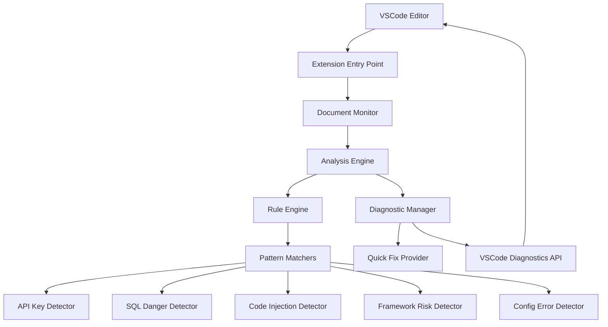

# Design Document

## Overview

VibeGuard VSCode 扩展采用基于规则引擎的实时代码分析架构，专门为非技术用户设计。系统通过正则表达式模式匹配检测危险代码，并通过 VSCode 的诊断 API 提供实时反馈和一键修复功能。设计重点是简单、快速、准确，避免复杂的 AST 解析以确保性能和可维护性。

## Architecture

### 系统架构图



### 核心组件关系

1. **Extension Entry Point** 负责初始化和注册所有服务
2. **Document Monitor** 监听文档变化并触发分析
3. **Analysis Engine** 协调规则执行和结果处理
4. **Rule Engine** 管理和执行检测规则
5. **Diagnostic Manager** 处理 VSCode 诊断显示
6. **Quick Fix Provider** 提供一键修复功能

## Components and Interfaces

### 1. Extension Entry Point (`extension.ts`)

```typescript
interface ExtensionContext {
  activate(context: vscode.ExtensionContext): void;
  deactivate(): void;
}

interface Services {
  documentMonitor: DocumentMonitor;
  analysisEngine: AnalysisEngine;
  diagnosticManager: DiagnosticManager;
  quickFixProvider: QuickFixProvider;
}
```

**职责:**
- 初始化所有核心服务
- 注册 VSCode 事件监听器
- 管理扩展生命周期
- 配置诊断集合和代码操作提供者

### 2. Document Monitor (`monitor/DocumentMonitor.ts`)

```typescript
interface DocumentMonitor {
  startMonitoring(): void;
  stopMonitoring(): void;
  onDocumentChange(document: vscode.TextDocument): void;
  onDocumentOpen(document: vscode.TextDocument): void;
}

interface MonitorConfig {
  debounceDelay: number; // 500ms
  supportedLanguages: string[]; // js, ts, sql, json, etc.
  maxFileSize: number; // 1MB limit
}
```

**职责:**
- 监听文档打开、编辑、保存事件
- 实现防抖机制避免过度分析
- 过滤支持的文件类型
- 处理大文件的增量分析

### 3. Analysis Engine (`analyzer/AnalysisEngine.ts`)

```typescript
interface AnalysisEngine {
  analyzeDocument(document: vscode.TextDocument): Promise<SecurityIssue[]>;
  analyzeText(text: string, language: string): Promise<SecurityIssue[]>;
  analyzeIncremental(document: vscode.TextDocument, changes: vscode.TextDocumentContentChangeEvent[]): Promise<SecurityIssue[]>;
}

interface SecurityIssue {
  code: string;
  severity: 'error' | 'warning';
  message: string;
  line: number;
  column: number;
  length: number;
  quickFix?: QuickFix;
  category: 'api-key' | 'sql-danger' | 'code-injection' | 'framework-risk' | 'config-error';
}

interface QuickFix {
  title: string;
  replacement: string;
  description: string;
}
```

**职责:**
- 协调多个规则引擎的执行
- 处理增量分析逻辑
- 合并和去重检测结果
- 提供性能优化（缓存、并行处理）

### 4. Rule Engine (`rules/RuleEngine.ts`)

```typescript
interface RuleEngine {
  executeRules(text: string, language: string): SecurityIssue[];
  registerRule(rule: DetectionRule): void;
  getRulesByCategory(category: string): DetectionRule[];
}

interface DetectionRule {
  id: string;
  category: string;
  severity: 'error' | 'warning';
  pattern: RegExp;
  message: string;
  quickFix?: QuickFixTemplate;
  whitelist?: string[];
  languages: string[];
  enabled: boolean;
}

interface QuickFixTemplate {
  title: string;
  replacement: string | ((match: RegExpExecArray) => string);
  description: string;
}
```

**职责:**
- 管理所有检测规则
- 执行模式匹配
- 处理白名单过滤
- 生成快速修复建议

### 5. Pattern Matchers (规则定义)

#### API Key Detector (`rules/definitions/api-keys.ts`)
```typescript
const API_KEY_RULES: DetectionRule[] = [
  {
    id: 'API_KEY_OPENAI',
    pattern: /sk-[a-zA-Z0-9]{48}/g,
    message: '🔑 危险！OpenAI API 密钥暴露！这就是那个设计师损失 $5000 的原因！',
    severity: 'error',
    quickFix: {
      title: '使用环境变量',
      replacement: 'process.env.OPENAI_API_KEY'
    }
  },
  {
    id: 'API_KEY_AWS',
    pattern: /AKIA[0-9A-Z]{16}/g,
    message: '🔑 危险！AWS 访问密钥暴露！黑客可以控制你的云服务！',
    severity: 'error'
  }
];
```

#### SQL Danger Detector (`rules/definitions/sql-rules.ts`)
```typescript
const SQL_DANGER_RULES: DetectionRule[] = [
  {
    id: 'SQL_DELETE_NO_WHERE',
    pattern: /DELETE\s+FROM\s+\w+\s*;/gi,
    message: '💀 致命错误！DELETE 没有 WHERE 条件会删除整个表！',
    severity: 'error',
    quickFix: {
      title: '添加 WHERE 条件',
      replacement: (match) => match[0].replace(';', ' WHERE id = ?;')
    }
  }
];
```

### 6. Diagnostic Manager (`diagnostics/DiagnosticManager.ts`)

```typescript
interface DiagnosticManager {
  updateDiagnostics(document: vscode.TextDocument, issues: SecurityIssue[]): void;
  clearDiagnostics(document: vscode.TextDocument): void;
  getDiagnosticCollection(): vscode.DiagnosticCollection;
}

interface DiagnosticConfig {
  collectionName: 'vibeguard';
  maxDiagnosticsPerFile: number; // 50
  groupSimilarIssues: boolean; // true
}
```

**职责:**
- 将 SecurityIssue 转换为 VSCode Diagnostic
- 管理诊断的显示和清除
- 处理诊断的分组和优先级
- 提供诊断相关的元数据

### 7. Quick Fix Provider (`quickfix/QuickFixProvider.ts`)

```typescript
interface QuickFixProvider extends vscode.CodeActionProvider {
  provideCodeActions(
    document: vscode.TextDocument,
    range: vscode.Range,
    context: vscode.CodeActionContext
  ): vscode.CodeAction[];
}

interface FixAction {
  title: string;
  kind: vscode.CodeActionKind;
  edit: vscode.WorkspaceEdit;
  isPreferred: boolean;
}
```

**职责:**
- 实现 VSCode CodeActionProvider 接口
- 为每个诊断提供对应的修复操作
- 处理复杂的代码替换逻辑
- 支持批量修复功能

## Data Models

### 核心数据结构

```typescript
// 安全问题模型
interface SecurityIssue {
  id: string;
  code: string;
  category: SecurityCategory;
  severity: IssueSeverity;
  message: string;
  description: string;
  location: IssueLocation;
  quickFix?: QuickFix;
  metadata: IssueMetadata;
}

// 问题位置
interface IssueLocation {
  line: number;
  column: number;
  length: number;
  startOffset: number;
  endOffset: number;
}

// 问题元数据
interface IssueMetadata {
  ruleId: string;
  language: string;
  confidence: number; // 0-1
  impact: 'low' | 'medium' | 'high' | 'critical';
  effort: 'easy' | 'medium' | 'hard'; // 修复难度
  tags: string[];
}

// 安全类别
enum SecurityCategory {
  API_KEY = 'api-key',
  SQL_DANGER = 'sql-danger',
  CODE_INJECTION = 'code-injection',
  FRAMEWORK_RISK = 'framework-risk',
  CONFIG_ERROR = 'config-error'
}

// 问题严重程度
enum IssueSeverity {
  ERROR = 'error',
  WARNING = 'warning',
  INFO = 'info'
}
```

### 规则配置模型

```typescript
// 规则配置
interface RuleConfig {
  rules: { [ruleId: string]: RuleSettings };
  global: GlobalSettings;
}

interface RuleSettings {
  enabled: boolean;
  severity?: IssueSeverity;
  customMessage?: string;
  whitelist?: string[];
}

interface GlobalSettings {
  enableRealTimeAnalysis: boolean;
  debounceDelay: number;
  maxFileSize: number;
  supportedLanguages: string[];
  showQuickFixes: boolean;
}
```

## Error Handling

### 错误处理策略

1. **静默失败原则**: 分析错误不应影响用户的正常编辑体验
2. **降级处理**: 当某个规则失败时，继续执行其他规则
3. **性能保护**: 设置超时和资源限制防止扩展卡死
4. **用户友好**: 错误信息使用中文，避免技术术语

```typescript
// 错误处理接口
interface ErrorHandler {
  handleAnalysisError(error: Error, document: vscode.TextDocument): void;
  handleRuleError(error: Error, rule: DetectionRule): void;
  reportError(error: Error, context: string): void;
}

// 错误类型
class VibeGuardError extends Error {
  constructor(
    message: string,
    public code: string,
    public category: 'analysis' | 'rule' | 'system',
    public recoverable: boolean = true
  ) {
    super(message);
  }
}

// 错误处理实现
class DefaultErrorHandler implements ErrorHandler {
  handleAnalysisError(error: Error, document: vscode.TextDocument): void {
    console.error(`VibeGuard 分析失败: ${document.fileName}`, error);
    // 静默失败，不显示错误给用户
    // 可选：发送遥测数据用于改进
  }
  
  handleRuleError(error: Error, rule: DetectionRule): void {
    console.warn(`规则执行失败: ${rule.id}`, error);
    // 禁用有问题的规则，继续其他规则
  }
}
```

### 性能保护机制

```typescript
interface PerformanceGuard {
  maxAnalysisTime: number; // 5000ms
  maxFileSize: number; // 1MB
  maxRulesPerAnalysis: number; // 100
  enableTimeout: boolean;
}

// 超时保护
async function analyzeWithTimeout<T>(
  operation: () => Promise<T>,
  timeout: number
): Promise<T | null> {
  try {
    return await Promise.race([
      operation(),
      new Promise<null>((_, reject) => 
        setTimeout(() => reject(new Error('分析超时')), timeout)
      )
    ]);
  } catch (error) {
    console.warn('分析操作超时或失败', error);
    return null;
  }
}
```

## Testing Strategy

### 测试层次结构

1. **单元测试**: 测试各个组件的核心功能
2. **集成测试**: 测试组件间的协作
3. **端到端测试**: 测试完整的用户场景
4. **性能测试**: 验证大文件和实时分析性能

### 关键测试场景

#### 1. 规则检测测试
```typescript
describe('API Key Detection', () => {
  const testCases = [
    {
      name: 'OpenAI API Key',
      code: 'const apiKey = "sk-proj-1234567890abcdef1234567890abcdef12345678";',
      expectedIssues: 1,
      expectedSeverity: 'error'
    },
    {
      name: 'Environment Variable (Safe)',
      code: 'const apiKey = process.env.OPENAI_API_KEY;',
      expectedIssues: 0
    },
    {
      name: 'Comment (Should Ignore)',
      code: '// Example: sk-proj-1234567890abcdef1234567890abcdef12345678',
      expectedIssues: 0
    }
  ];
  
  testCases.forEach(testCase => {
    it(`should handle ${testCase.name}`, () => {
      const issues = analyzeText(testCase.code, 'javascript');
      expect(issues).toHaveLength(testCase.expectedIssues);
      if (testCase.expectedIssues > 0) {
        expect(issues[0].severity).toBe(testCase.expectedSeverity);
      }
    });
  });
});
```

#### 2. 快速修复测试
```typescript
describe('Quick Fix Provider', () => {
  it('should provide fix for hardcoded API key', async () => {
    const document = await createTestDocument(
      'const key = "sk-proj-abcd1234";'
    );
    const actions = await quickFixProvider.provideCodeActions(
      document,
      new vscode.Range(0, 13, 0, 35),
      createCodeActionContext()
    );
    
    expect(actions).toHaveLength(1);
    expect(actions[0].title).toContain('环境变量');
    expect(actions[0].edit?.get(document.uri)?.[0].newText)
      .toBe('process.env.API_KEY');
  });
});
```

#### 3. 性能测试
```typescript
describe('Performance Tests', () => {
  it('should analyze large file within time limit', async () => {
    const largeCode = generateLargeCodeFile(10000); // 10k lines
    const startTime = Date.now();
    
    const issues = await analysisEngine.analyzeText(largeCode, 'javascript');
    const duration = Date.now() - startTime;
    
    expect(duration).toBeLessThan(5000); // 5 seconds max
    expect(issues).toBeDefined();
  });
  
  it('should handle rapid document changes', async () => {
    const document = await createTestDocument('');
    
    // Simulate rapid typing
    for (let i = 0; i < 100; i++) {
      await simulateDocumentChange(document, `line ${i}\n`);
    }
    
    // Should not crash or block
    expect(diagnosticManager.getDiagnostics(document.uri)).toBeDefined();
  });
});
```

### 真实场景测试数据

```typescript
// 基于真实 AI 生成代码的测试用例
const realWorldTestCases = [
  {
    name: 'ChatGPT Generated OpenAI Integration',
    code: `
      import OpenAI from 'openai';
      
      const openai = new OpenAI({
        apiKey: 'sk-proj-1234567890abcdef1234567890abcdef12345678'
      });
      
      async function generateText(prompt) {
        const response = await openai.chat.completions.create({
          model: 'gpt-3.5-turbo',
          messages: [{ role: 'user', content: prompt }]
        });
        return response.choices[0].message.content;
      }
    `,
    expectedIssues: ['API_KEY_OPENAI']
  },
  
  {
    name: 'Claude Generated SQL Query',
    code: `
      // Delete all inactive users
      const query = "DELETE FROM users WHERE status = 'inactive'";
      
      // Oops, forgot the WHERE clause in this one
      const dangerousQuery = "DELETE FROM users";
    `,
    expectedIssues: ['SQL_DELETE_NO_WHERE']
  }
];
```

### 测试工具和框架

- **单元测试**: Jest + @types/jest
- **VSCode 测试**: @vscode/test-electron
- **模拟工具**: 自定义 VSCode API 模拟器
- **性能测试**: 自定义性能测量工具
- **覆盖率**: Istanbul/nyc

## 实现优先级

### Phase 1: 核心功能 (Week 1-2)
1. 基础扩展架构和文档监听
2. API 密钥检测规则（最高优先级）
3. SQL 危险操作检测
4. 基础诊断显示和快速修复

### Phase 2: 增强功能 (Week 3-4)
1. 代码注入检测（eval, innerHTML）
2. 框架特定风险检测（React, Vue）
3. 性能优化（增量分析、防抖）
4. 错误处理和容错机制

### Phase 3: 完善体验 (Week 5-6)
1. 配置错误检测
2. 高级快速修复功能
3. 用户体验优化
4. 全面测试和文档

这个设计确保了系统的可扩展性、性能和用户友好性，同时保持了代码的简洁性和可维护性。